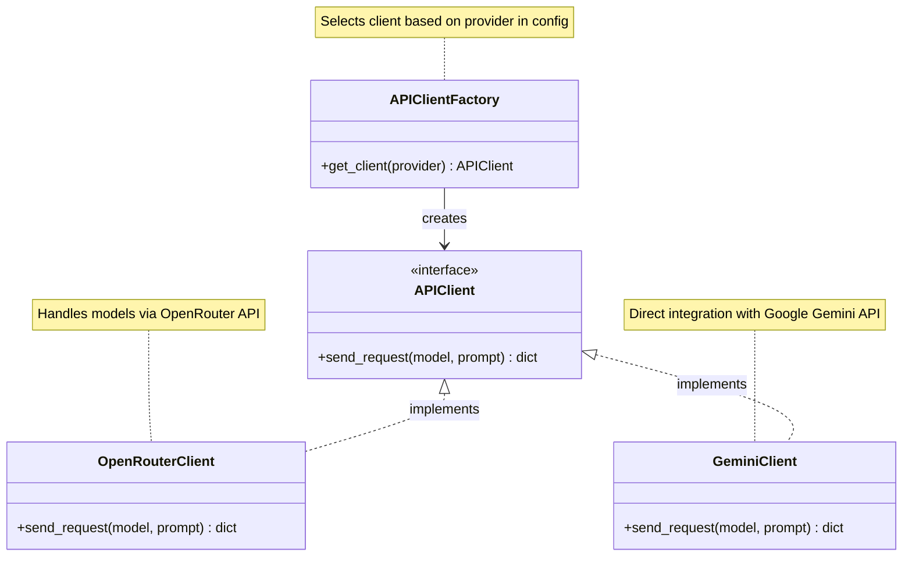

# Modular API Integration Plan for Google Gemini and Future Providers

## Objective
- Implement a direct API call for Google Gemini 2.5 Pro Experimental (03-25) using the Google AI Python SDK.
- Restructure the API client to be modular, allowing different providers (e.g., OpenRouter, Google Gemini) to be specified in the configuration.
- Ensure the system is extensible for future provider and model integrations.

## Background
The current application uses the OpenRouter API to communicate with various LLMs for comparing their responses on sensor datasheets. The task is to integrate the Google Gemini 2.5 Pro Experimental (03-25) model directly using the Google AI Python SDK for full control and access to experimental features, while also creating a modular structure to support multiple API providers in the future.

## Integration Plan

### 1. Update Configuration Structure (`config/config.yaml`)
- Restructure the 'models' section to include provider information for each model, specifying whether to use OpenRouter or a direct API like Google Gemini.
- Add a section for provider-specific configurations, such as API keys and base URLs.
- Include a secure way to store the Google Gemini API key (e.g., using environment variables or a separate configuration).

**Example Configuration Update:**
```yaml
# API Keys and Provider Configurations
providers:
  openrouter:
    api_key: "sk-or-v1-"
    base_url: "https://openrouter.ai/api/v1"
    timeout: 60
  google_gemini:
    api_key_env: "GOOGLE_API_KEY"  # Reference to environment variable
    timeout: 120

# Models with Provider Specification
models:
  - id: "openai/chatgpt-4o-latest"
    provider: "openrouter"
  - id: "meta-llama/llama-3.3-70b-instruct:free"
    provider: "openrouter"
  - id: "anthropic/claude-3.5-haiku"
    provider: "openrouter"
  - id: "google/gemini-2.5-pro-exp-03-25"
    provider: "google_gemini"
  - id: "mistralai/mistral-small-3.1-24b-instruct:free"
    provider: "openrouter"
```

### 2. Create Modular API Client Structure (`src/api_client.py`)
- Refactor the existing `OpenRouterClient` into a base structure or a specific implementation under a modular framework.
- Introduce a new `GeminiClient` class for direct integration with the Google Gemini API using the Google AI Python SDK.
- Implement a factory or registry pattern to select the appropriate client based on the provider specified in the configuration.
- Ensure each client handles its specific API requirements (e.g., authentication, request format) while maintaining a consistent interface for the application to use.

**Key Changes:**
- Add necessary dependencies for Google Gemini (`google-generativeai`, `python-dotenv`).
- Implement error handling and response processing tailored to each provider.

### 3. Modify Application Flow (`src/main.py`)
- Update the initialization to load provider configurations and instantiate the appropriate API clients based on the models selected.
- Adjust the request sending logic to use the correct client for each model based on its provider.
- Maintain the existing workflow for user interaction, result processing, and metrics logging, ensuring compatibility with the modular client structure.

### 4. Environment Setup and Security
- Ensure the Google Gemini API key is stored securely using environment variables or a `.env` file, as recommended in the integration guide.
- Update the project requirements to include new dependencies for the Gemini SDK.

### 5. Testing and Validation
- Test the integration with a sample prompt to verify that the Gemini model responds correctly through the direct API.
- Validate that other models continue to work through OpenRouter without disruption.
- Check for proper error handling and response processing for both providers.

## Modular API Client Structure Diagram



This diagram illustrates the factory pattern for selecting the appropriate API client based on the provider specified in the configuration, ensuring modularity and extensibility.

## Future Considerations
- The modular structure will allow easy addition of new providers (e.g., other API-based integrations) by adding new client classes and updating the configuration.
- Documentation will be updated to reflect the new structure for future maintainers or developers.

## Conclusion
This plan outlines the steps to integrate the Google Gemini API directly for the specified model while establishing a modular API client structure. This approach ensures flexibility and scalability for future provider integrations, aligning with the project's long-term goals.