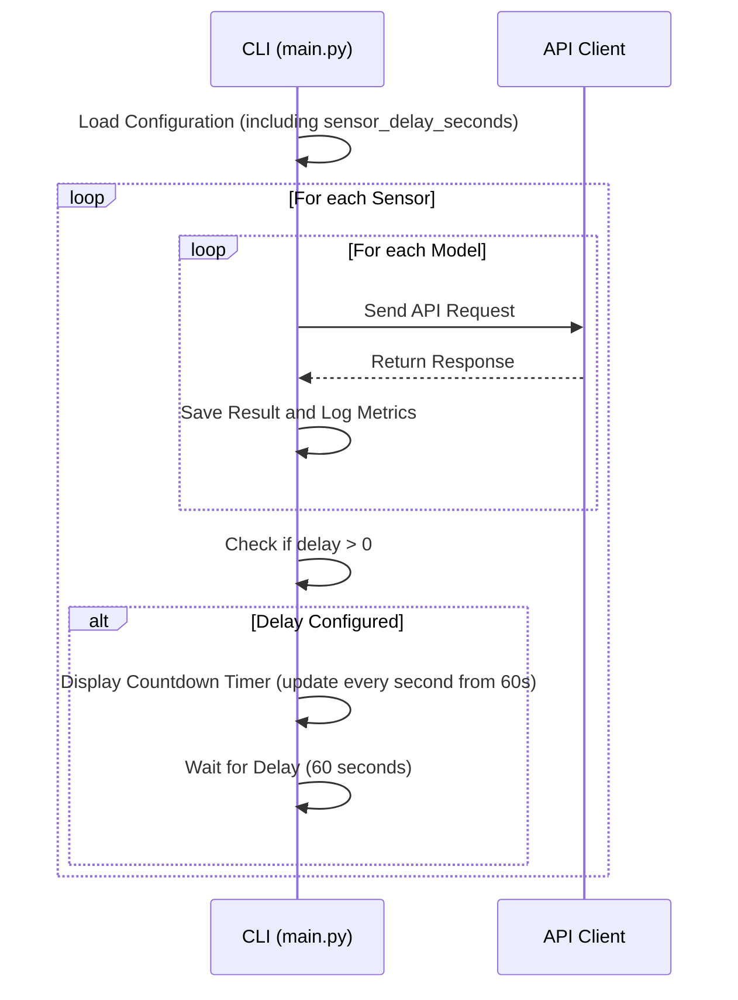

# Countdown Timer Implementation Plan

## Overview
This plan outlines the steps to add a countdown timer to the CLI of the LLM Sensor Knowledge Comparison Tool. The timer will display a 60-second delay after processing all models for a sensor before moving to the next sensor, as requested by the user.

## Detailed Plan

1. **Add Configurable Delay to Configuration File**
   - Update 'config.yaml' to include a new setting for a delay between sensor processing (e.g., `sensor_delay_seconds` globally).
   - Set the default value to 60 seconds as per user specification.

2. **Modify Main Loop to Respect Delay**
   - Update the request loop in 'main.py' to check for the configured `sensor_delay_seconds` after processing all models for a sensor.
   - Use a sleep mechanism to wait for the specified delay if it's greater than 0.

3. **Implement Countdown Timer in CLI**
   - After processing all models for a sensor in 'main.py', if a delay is configured, display a countdown timer in the CLI using the 'rich' library (already used in the project for console output).
   - The countdown will update every second, showing the remaining time (starting from 60 seconds) until the next sensor's API calls start.

4. **Update Status Messages**
   - Enhance the status messages to indicate when the application is waiting due to the configured delay between sensors, ensuring transparency in the CLI output.

## Flow Diagram

## Approval
This plan has been approved by the user on 5/4/2025.