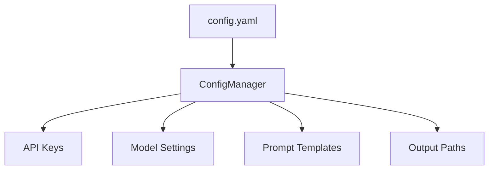
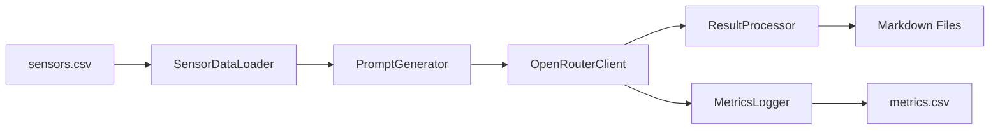
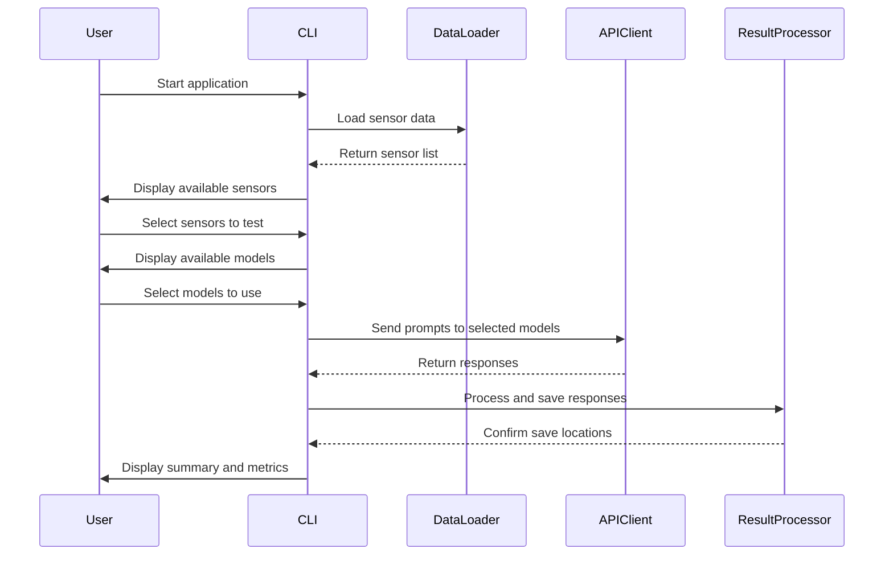

# LLM Sensor Knowledge Comparison Application - Detailed Plan

## 1. Application Overview

We'll create a Python CLI application that:
- Connects to OpenRouter API to access multiple LLM models (Claude 3 Opus, GPT-4, Llama 3)
- Reads sensor information from a CSV file
- Generates prompts about these sensors
- Sends these prompts to different LLMs
- Saves structured responses as markdown files
- Logs performance metrics for each model

## 2. Project Structure

```
llm-sensor-comparison/
├── config/
│   └── config.yaml           # Configuration file for API keys, models, etc.
├── data/
│   └── sensors.csv           # CSV file with sensor information
├── prompts/
│   └── base_prompt.txt       # Template for the prompts
├── results/
│   └── [sensor_name]/        # Folders for each sensor
│       └── [model_name].md   # Results from each model
├── logs/
│   └── metrics.csv           # Performance metrics log
├── src/
│   ├── __init__.py
│   ├── main.py               # Entry point for the application
│   ├── api_client.py         # OpenRouter API client
│   ├── prompt_generator.py   # Generates prompts from templates and sensor data
│   ├── result_processor.py   # Processes and saves results
│   └── metrics_logger.py     # Logs performance metrics
├── tests/
│   └── __init__.py
├── README.md
└── requirements.txt
```

## 3. Core Components

### 3.1 Configuration Management


### 3.2 Data Flow


### 3.3 Interactive CLI Workflow


## 4. Key Features Implementation

### 4.1 OpenRouter API Client
- Create a client class to handle authentication and API requests
- Implement methods for model selection and prompt submission
- Handle rate limiting and error responses
- Track response times and token usage

### 4.2 Prompt Generation
- Create a template system for prompts
- Allow customization based on sensor type
- Ensure prompts encourage structured responses with headings

### 4.3 Result Processing
- Parse and format responses as markdown
- Create appropriate directory structure for results
- Generate unique filenames based on sensor, model, and timestamp

### 4.4 Metrics Logging
- Log response time, token count, and response length
- Create a CSV file with all metrics for easy analysis
- Include timestamp, model, sensor, and other relevant metadata

### 4.5 Interactive CLI
- Use a library like `click` or `typer` for a user-friendly CLI
- Implement progress bars for long-running operations
- Provide colored output for better readability
- Allow for batch processing or individual sensor testing

## 5. Technical Requirements

### 5.1 Dependencies
- `openai` or custom HTTP client for OpenRouter API
- `pandas` for CSV handling
- `pyyaml` for configuration
- `click` or `typer` for CLI interface
- `rich` for enhanced terminal output
- `pytest` for testing

### 5.2 Error Handling
- Implement robust error handling for API failures
- Add retry mechanisms for transient errors
- Provide clear error messages to the user

### 5.3 Logging
- Implement comprehensive logging throughout the application
- Log all API requests, responses, and errors
- Create separate log files for application events and metrics

## 6. Implementation Plan

### Phase 1: Core Infrastructure
1. Set up project structure
2. Implement configuration management
3. Create OpenRouter API client
4. Implement basic CSV parsing

### Phase 2: Prompt and Response Handling
1. Develop prompt template system
2. Implement result processor
3. Create directory structure for results
4. Implement metrics logging

### Phase 3: CLI and User Experience
1. Develop interactive CLI interface
2. Add progress indicators and colored output
3. Implement sensor and model selection
4. Add batch processing capabilities

### Phase 4: Testing and Refinement
1. Write unit tests
2. Perform integration testing
3. Optimize performance
4. Refine user experience based on feedback

## 7. Future Enhancements
1. Add support for more LLM providers
2. Implement automatic comparison of results
3. Create visualization tools for metrics
4. Add support for custom prompt templates
5. Implement parallel processing for faster batch operations