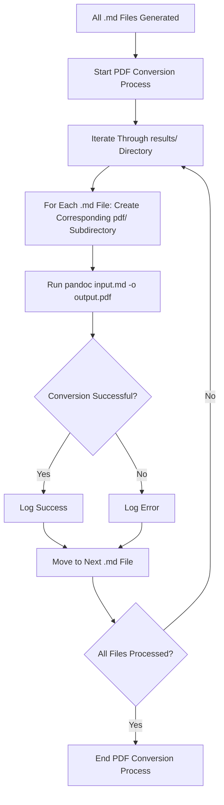

# PDF Conversion Plan for .md Files

**Objective**: Automate the conversion of generated .md files to PDF format using 'pandoc' after all files are created, maintaining the same subfolder structure in a new `/pdf` directory.

## Steps

1. **Modify `src/main.py` to Include PDF Conversion**:
   - Add a new section of code after line 143 in `main.py`, where all .md file generation is complete (after the message "[bold green]All requests completed![/bold green]").
   - This section will iterate through all .md files in the `results/` directory and its subdirectories.

2. **Create `/pdf` Directory Structure**:
   - For each .md file found in `results/`, replicate the subfolder structure in a new `/pdf` directory. For example, an .md file in `results/Adafruit_DHT22/` will have its PDF saved in `pdf/Adafruit_DHT22/`.
   - Ensure the necessary directories are created if they don't exist.

3. **Convert .md to PDF Using 'pandoc'**:
   - Use the `subprocess` module in Python to run 'pandoc' as a command-line tool for each .md file.
   - The command will be structured as `pandoc input.md -o output.pdf`, with paths adjusted to match the input and output locations.
   - Use default styling as specified (no custom templates or styles needed).

4. **Error Handling and Logging**:
   - Implement error handling to catch issues during the conversion process (e.g., 'pandoc' not installed, file access errors).
   - Log the success or failure of each conversion to the console, similar to how request processing is logged, to keep the user informed.

5. **Update Configuration if Necessary**:
   - Check if 'pandoc' needs to be added as a dependency or if its installation should be verified in the script or documentation (e.g., in `requirements.txt` or `README.md`).
   - If needed, add a note in the configuration or documentation about requiring 'pandoc' to be installed on the system.

## Implementation Flow

## Key Considerations
- Ensure 'pandoc' is installed on the system; if not, the script should provide a helpful error message prompting installation.
- Maintain the exact subfolder structure to keep PDFs organized identically to the .md files.
- Handle potential file path issues on different operating systems (use `os.path` for cross-platform compatibility).

## Next Steps After Approval
- Switch to a mode suitable for code implementation (e.g., "Code" mode) to modify `src/main.py` and potentially other files as needed.
- Test the implementation to ensure the conversion works as expected and PDFs are saved correctly.